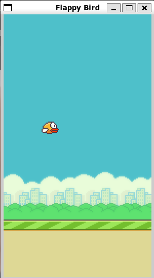

# Flappy Bird

A Flappy Bird clone developed using JavaFX18.

## Table of Contents

- [Prerequisites](#prerequisites)
- [Build](#build)
- [Usage](#usage)
  - [Using Maven](#using-maven)
  - [Using Executable](#using-executable)

## Prerequisites

- Optional (only required when rebuilding) - [Maven](https://maven.apache.org/)

## Build

To create an executable image, simply run `mvn clean javafx:jlink` in the root directory.

## Usage

The two methods of running the project are listed below.

### Using Maven

If all [prerequisites](#prerequisites) are installed, execute `mvn clean javafx:run`.
A running instance of the game should be shown.

### Using Executable

You can download and run the `launcher` executable found in latest release under `flappybird/bin`.
Alternatively, if you have rebuilt the project, you can run the `launcher` executable found in [the target/flappybird/bin folder](target/flappybird/bin/launcher).
