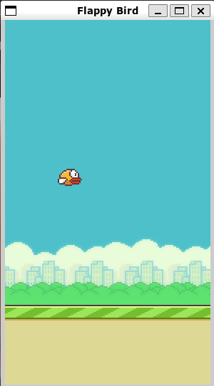

<p align="center">
  <h1 align="center">Flappy Bird</h1>
  <p align="center">
    A Flappy Bird clone built with JavaFX and Java 21.
    <br /><br />
    <a href="https://github.com/urmzd/flappy-bird/releases">Download</a>
    &middot;
    <a href="https://github.com/urmzd/flappy-bird/issues">Report Bug</a>
  </p>
</p>

<p align="center">
  <a href="https://github.com/urmzd/flappy-bird/actions/workflows/ci.yml"></a>
</p>

## Download

Get the latest release for your platform from the [Releases page](../../releases):

| Platform | Download | After extracting |
|----------|----------|-----------------|
| macOS | `flappybird-macos.zip` | Double-click **FlappyBird.app** |
| Windows | `flappybird-windows.zip` | Run **FlappyBird\FlappyBird.exe** |
| Linux | `flappybird-linux.zip` | Run **FlappyBird/bin/FlappyBird** |

No Java installation required — the download includes a bundled runtime.

> **macOS users:** macOS may block the application since it is not signed. To allow it,
> right-click **FlappyBird.app**, select **Open**, then click **Open** in the dialog.
> Alternatively, go to **System Settings → Privacy & Security** and click **Open Anyway**.

## Controls

| Key | Action |
|-----|--------|
| SPACE | Jump / Start |
| Any key | Restart (after game over) |

## Screenshot



## Agent Skill

```bash
npx skills add urmzd/flappy-bird
```

## Development

See [SETUP.md](./SETUP.md) for build instructions and project architecture.